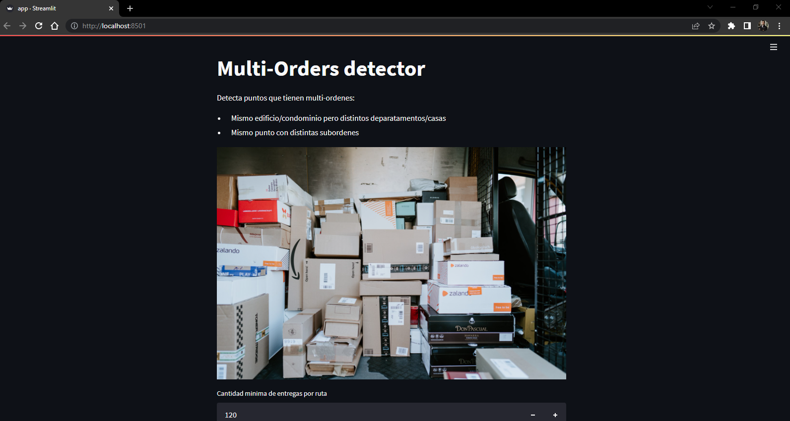

# Multi-Orders Routes

## Project requirements

* Python 3.x (the project was developed using python 3.8)
* virtualenv installed (associated with you py3 installation)
* pip installed (associated with you py3 installation)

## Local installation

```bash
git clone https://github.com/fzentillit/multiOrdersRoutes.git
```
Create virtual environment:

```bash
virtualenv -p python3 venv
```
Activate the virtual environment:
```bash
venv/Scripts/activate
```
Packages installation with pip:
```bash
pip install -r requirements.txt
```

If the installation of the next packages fails, try:

```bash
pip install python-dotenv
pip install --upgrade google-auth
pip install google-cloud-bigquery
```

Special version for Streamlit-cloud

```bash
pandas==1.3.5
numpy==1.21.6
```

Forbidden packages for Streamlit-cloud

```bash
pywin32
pywinpty
```


For create all directories:
```bash
 python .\configs.py
```


## Google Cloud Platform Credentials & Environments Variables

Copy the file `.env.example` and change the name to `.env` and fill with the respective credentials, where
`GCP_CRED_NAME` is the name of the [Google Cloud Platform Service Account Key](https://cloud.google.com/iam/docs/creating-managing-service-account-keys) and `GCP_PROJECT_ID` the name of the project 
where you will work. The Service Account Key must be saved in the main folder of this project as a json file. Configure the secret streamlit manager following the instructions [here](https://docs.streamlit.io/streamlit-cloud/get-started/deploy-an-app/connect-to-data-sources/secrets-management).


## Getting Started

Run all tests
```bash
python -m unittest discover -s tests  -p '__*.py' 
```

Open the terminal in you machine and run the following command to access the web application in your localhost.
```bash
streamlit run app.py
```

You are ready! and you will have something like this:



You can use the file `tests/inputs/testRegions01.xlsx` to test the app (same for local or cloud).


## Deploy App

[Streamlit Cloud](https://share.streamlit.io/) launches apps directly from your GitHub repo, so your app code and dependencies need to be on GitHub before you try to deploy the app. 
To deploy an app, click "New app" from the upper right corner of your workspace, then fill in your repo, branch, and file path, and click "Deploy". As a shortcut, you can also click "Paste GitHub URL". For more details clic [here](https://docs.streamlit.io/streamlit-cloud/get-started/deploy-an-app).


